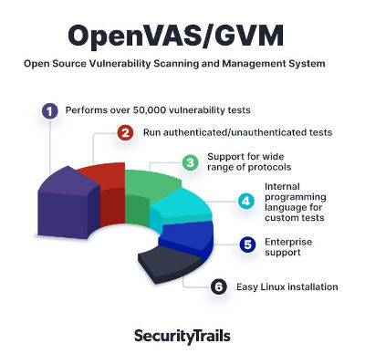
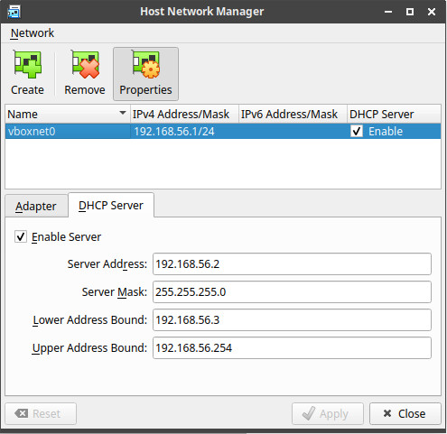

# Table of Contents

1.  [Requirements](#org5255b17)
2.  [What is OpenVAS?](#org6dcfb42)
3.  [Network setup](#orgf52ecf5)
4.  [Virtual machines setup](#org51e2f1c)
    1.  [OpenVAS VM setup ](#org1ff202a)
    2.  [Metasploitable2 VM setup ](#orgf39e180)
    3.  [Exporting to .ova](#org14aa7fa)
5.  [Exercises](#org9359302)
    1.  [Exercises](#org9e5e7bf)
6.  [References](#org91759a7)

Notes for the OpenVAS lab for the Network Security class.

# Requirements

We are going to use

-   Oracle VM VirtualBox 6.1.16 (download [here](https://www.virtualbox.org/wiki/Downloads))
-   GSM TRIAL 20.08.8 (download [here](https://www.greenbone.net/en/testnow/#toggle-id-4-closed))
-   Metasploitable 2 (download [here](https://information.rapid7.com/download-metasploitable-2017.html))

# What is OpenVAS?

OpenVAS (Open Vulnerability Assessment Scanner) is <a id="fnr.1" class="footref" href="#fn.1">1</a>

-   A full-featured scan engine that executes a continuously updated and extended feed of Network Vulnerability Tests (NVTs).
-   Part of GVM (Greenbone Vulnerability Management)

OpenVAS can use two daily updated feeds

-   **GCF:** Greenbone Community Feed, available with the free version
-   **GSF:** Greenbone Security Feed, available with the paid version. Includes advanced NVTs to target enterprise environments.

# Network setup

Before using the VMs be sure to have them connected through a host-only network: we don&rsquo;t want to expose our VMs to the network, especially the vulnerable target. To setup a `Host-only Adapter`

-   Go to `File > Host Network Manager...`
-   Click on `Create`, take note of the name of the adapter (e.g. `voboxnet0`)
-   Click on `Properties > DHCP Server > Enable Server`
-   Click `Apply` and close the window

# Virtual machines setup

## OpenVAS VM setup <a id="fnr.2" class="footref" href="#fn.2">2</a>

1.  Import the GSM TRIAL image from VirtualBox and select it go to Settings > Network. On the tab &ldquo;Adapter 1&rdquo; set &ldquo;Attached to:&rdquo; to &ldquo;Host-only Adapter&rdquo; and set the adapter (e.g. `voboxnet0`). Start the virtual machine.
2.  The Greenbone OS is loaded. To access the Greenbone Administration panel log in with username `admin` and password `admin`.
3.  At the first log in, a First Setup Wizard is visualized, select &ldquo;Yes&rdquo; to continue.
4.  It is asked whether a web user should be created. This is required to use the web interface, select &ldquo;Yes&rdquo; and input account name `admin` and password `admin`. Select OK, a message informs the user that the web administrator has been created, and again select OK to close the message.
5.  Since we have no valid GSF subscription key, the appliance only uses the public Greenbone Community Feed (GCF) and not the Greenbone Security Feed (GSF). Skip the the subscription key dialog.
6.  A status check is performed, and the manager is ready to be used.
7.  Logout from the the administration panel. In the welcome screen, take note of the IP address used by the web interface (e.g. `192.168.56.102`) and shut down the VM.
8.  From the host machine, open a browser and connect to the noted IP address (e.g. <https://192.168.56.102>). After accepting the self-signed certificate, access the web interface and login with the previously set credentials (username `admin`, password `admin`).

## Metasploitable2 VM setup <a id="fnr.3" class="footref" href="#fn.3">3</a> , <a id="fnr.4" class="footref" href="#fn.4">4</a>

Metasploitable 2 is an intentionally vulnerable Ubuntu Linux virtual machine that is designed for testing common vulnerabilities. The metasploitable ISO is VMWare format.

1.  Unzip the file and create a new VM: choose Linux->Ubuntu (64bit), give it at least at least 1024MB RAM and do not create a HDD. Wait and add the disk \*.vmdk. Select the new VM and go to Settings > Network. On the tab &ldquo;Adapter 1&rdquo; set &ldquo;Attached to:&rdquo; to &ldquo;Host-only Adapter&rdquo; and set the adapter (e.g. `voboxnet0`). Start the virtual machine.
2.  Login using the credentials `msfadmin:msfadmin` and with `ifconfig` retrieve the IP address assigned to the VM
3.  From the host machine, open a browser and connect to the noted IP address (e.g. <https://192.168.56.101>). After accepting the self-signed certificate, access the web interface: a metasploitable2 web page should be displayed.

## Exporting to .ova

We can now create an `.ova` file containing two VMs: one for GSM, the other for Metasploitable 2.

1.  In VirtualBox, go to File > Export Appliance and select the VMs just created and click on Next
2.  Select from the dropwdown menu and choose the location of your `.ova` file
3.  Set the &ldquo;MAC Address Policy&rdquo; at &ldquo;Include all network adapter MAC adresses&rdquo; and click on Next
4.  Set the names of the two VMs (e.g. Metasploitable2 and OpenVAS) and click on &ldquo;Export&rdquo;

# Exercises

We have the following environment setup

-   OpenVAS virtual machine
    -   **Greenbone Administration panel:** `admin:admin`
    -   **Greenbone Web panel:** `admin:admin`
-   Metasploitable2 virtual machine
    -   **Metasploitable2 panel:** `msfadmin:msfadmin`
-   The two VMs are connected to a host-only network (see more in the section [Network setup](#orgf52ecf5))

## TODO Exercises

# References

-   [Greenbone Security Manager with Greenbone OS 20.08 - User Manual](https://docs.greenbone.net/GSM-Manual/gos-20.08/en/)
-   [A Brief Introduction to the OpenVAS Vulnerability Scanner](https://resources.infosecinstitute.com/topic/a-brief-introduction-to-the-openvas-vulnerability-scanner/)
-   [OpenVAS/GVM: An Open Source Vulnerability Scanning and Management System](https://securitytrails.com/blog/openvas-vulnerability-scanner)
-   [Exercise on vulnerability scan and accessment](http://knight.segfaults.net/EEE473Labs/Lab%206%20Part%202%20-%20Vulnerability%20Scanning%20with%20OpenVAS.htm)
-   [Lab example with OpenVAS](http://webpages.eng.wayne.edu/~fy8421/16sp-csc5991/labs/lab3-instruction.pdf)

# Footnotes

<a id="fn.1" href="#fnr.1">1</a> <https://community.greenbone.net/t/about-gvm-10-architecture/1231>

<a id="fn.2" href="#fnr.2">2</a> <https://resources.infosecinstitute.com/topic/a-brief-introduction-to-the-openvas-vulnerability-scanner/>

<a id="fn.3" href="#fnr.3">3</a> <https://medium.com/hacker-toolbelt/metasploitable-2-i-lab-setup-8cd4472d7958>

<a id="fn.4" href="#fnr.4">4</a> <https://docs.rapid7.com/metasploit/metasploitable-2/>
