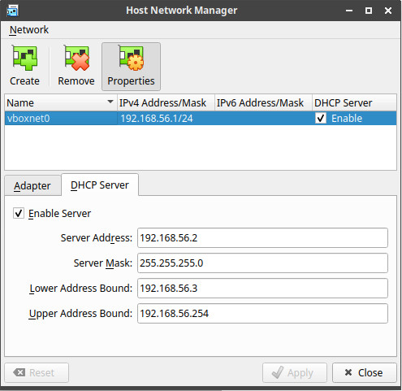
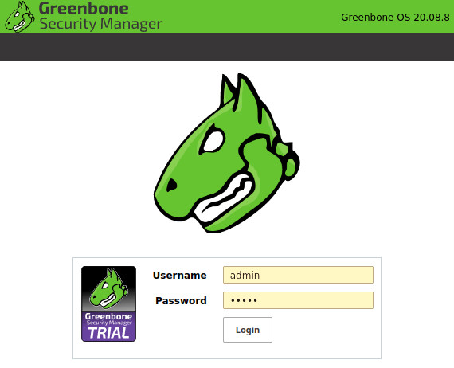
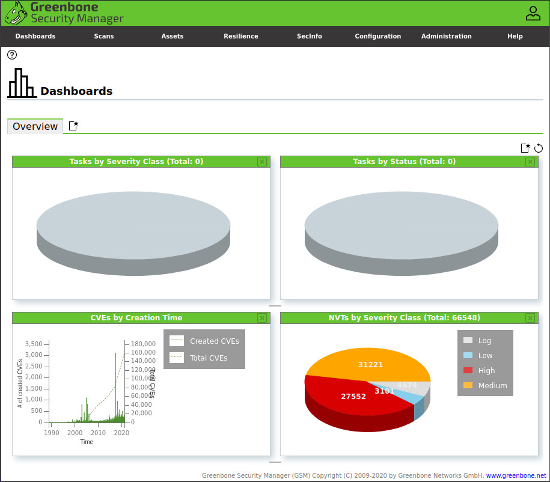
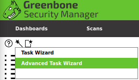
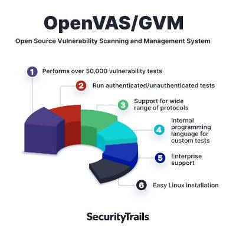
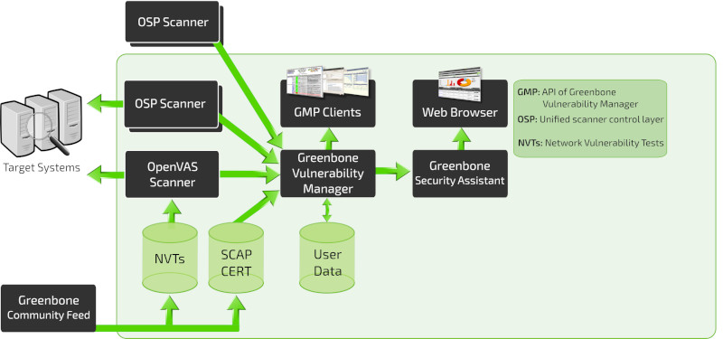

# Table of Contents

1.  [Requirements](#orgc59d6e3)
2.  [Network setup](#orgdce01c4)
3.  [Virtual machines setup](#orgf172824)
    1.  [OpenVAS VM setup ](#org534d427)
    2.  [Metasploitable2 VM setup ](#org794b517)
    3.  [Exporting to `.ova`](#orgdd03ec9)
4.  [Laboratory](#orgf67b4d4)
    1.  [First steps](#orgfcd2601)
    2.  [What is OpenVAS?](#orge1976af)
    3.  [Network vulnerability feed](#org5f16849)
    4.  [Scans](#org8050c30)
        1.  [Scan configuration](#org0ebdf63)
    5.  [Scan results](#org5f6fee9)
5.  [References](#org41e9c6d)

Notes for the OpenVAS lab for the Network Security class.

# Requirements

We are going to use

-   Oracle VM VirtualBox 6.1.16 (download [here](https://www.virtualbox.org/wiki/Downloads))
-   GSM TRIAL 20.08.8 (download [here](https://www.greenbone.net/en/testnow/#toggle-id-4-closed))
-   Metasploitable 2 (download [here](https://information.rapid7.com/download-metasploitable-2017.html))

# Network setup

Before using the VMs be sure to have them connected through a host-only network: we don&rsquo;t want to expose our VMs to the network, especially the vulnerable target. To setup a `Host-only Adapter`

-   Go to `File > Host Network Manager...`
-   Click on `Create`, take note of the name of the adapter (e.g. `voboxnet0`)
-   Click on `Properties > DHCP Server > Enable Server`
-   Click `Apply` and close the window

To connect a VM select it and go to `Settings > Network`. On the tab `Adapter 1` set `Attached to: Host-only Adapter` and set the right adapter (e.g. `voboxnet0`). Start the virtual machine.

# Virtual machines setup

## OpenVAS VM setup <a id="fnr.1" class="footref" href="#fn.1">1</a>

1.  Open VirtualBox and import the GSM TRIAL image, be sure to [connect it to the network adapter](#orgdce01c4).
2.  Start the virtual machine: the Greenbone OS is loaded. Access the Greenbone Administration panel with `admin:admin`.
3.  The first log in starts the `First Setup Wizard`, select `Yes` to continue.
4.  We are asked to create a web user (required to access the web interface), select `Yes` and input account name `admin` and password `admin`. Select `OK`, a message informs the user that the web administrator has been created, and again select `OK` to close the message.
5.  Since we have no valid GSF subscription key, the application only uses the public Greenbone Community Feed (GCF) and not the Greenbone Security Feed (GSF). Skip the the subscription key dialog.
6.  A status check is performed, and the manager is ready to be used.
7.  Logout from the the administration panel. In the welcome screen, take note of the IP address used by the web interface and shut down the VM.
8.  From the host machine, open a browser and connect to the IP address of the machine (e.g. <https://192.168.56.102>). After accepting the self-signed certificate, access the web interface and login with the previously set credentials.

## Metasploitable2 VM setup <a id="fnr.2" class="footref" href="#fn.2">2</a> , <a id="fnr.3" class="footref" href="#fn.3">3</a>

Metasploitable 2 is an intentionally vulnerable Ubuntu Linux virtual machine that is designed for testing common vulnerabilities. The metasploitable ISO is VMWare format.

1.  Unzip the file and create a new VM: choose `Linux->Ubuntu (64bit)`, give it at least at least 1024MB RAM and do not create a HDD. Wait and add the disk `*.vmdk`, remember to [connect the VM to the network adapter](#orgdce01c4). Start the virtual machine.
2.  Login using the credentials `msfadmin:msfadmin` and with `ifconfig` retrieve the IP address assigned to the VM
3.  From the host machine, open a browser and connect to the noted IP address (e.g. <https://192.168.56.101>). After accepting the self-signed certificate, access the web interface: a metasploitable2 web page should be displayed.

## Exporting to `.ova`

We can now create an `.ova` file containing two VMs: one for GSM, the other for Metasploitable 2.

1.  In VirtualBox, go to `File > Export Appliance` and select the VMs just created, click `Next`
2.  Select `Format: Open Virtualization Format`, set the path to your `.ova` file in `File:`. Click on `Next`.
3.  Set the names of the two VMs (e.g. `Metasploitable2` and `OpenVAS`) and click on `Export`.

# Laboratory

We have the following environment setup

-   OpenVAS virtual machine
    -   **Greenbone Administration panel:** `admin:admin`
    -   **Greenbone Web panel:** `admin:admin`
-   Metasploitable2 virtual machine
    -   **Metasploitable2 panel:** `msfadmin:msfadmin`
-   The two VMs are connected to a host-only network (see more in the section [Network setup](#orgdce01c4))

## First steps

From now on we are going to interact only through the Greenbone Web panel: connect to it through a web browser and login with the credentials `admin:admin`.

The first thing we can do is scheduling a network scan to find out who is connected to the network. From the top menu, go to `Scans > Tasks` and move the cursor to the magic wand icon (🪄), select `Advanced Task Wizard`.

Input the following settings and the click on `Create`

-   **Task name:** `Network discovery`
-   **Scan Config:** `Discovery`
-   **Target Host(s):** The IP address of the host-only subnet created in VirtualBox (e.g. `192.168.56.0/24`)
-   **Start Time:** `Start immediately`

We repeat the same process to create another task, this time with the following settings

-   **Task name:** `Target discovery`
-   **Scan Config:** `Full and fast`
-   **Target Host(s):** The IP address of the Metasploitable2 VM (e.g. `192.168.56.4`)
-   **Start Time:** `Start immediately`

The two scans will take few minutes to complete, meanwhile we can have an overview of the tool.

## What is OpenVAS?

OpenVAS (Open Vulnerability Assessment Scanner) is <a id="fnr.4" class="footref" href="#fn.4">4</a>

-   A full-featured scan engine that executes a continuously updated and extended feed of Network Vulnerability Tests (NVTs).
-   Part of GVM (Greenbone Vulnerability Management)

The GVM architecture is described by the scheme below

## Network vulnerability feed

OpenVAS can use two daily updated feeds of Network Vulnerability Tests (NVTs)

-   **GCF:** Greenbone Community Feed, available with the free version
-   **GSF:** Greenbone Security Feed, available with the commercial version. Includes advanced NVTs to target enterprise environments. If no valid GSF subscription key is stored on the appliance, the appliance only uses the public Greenbone Community Feed (GCF) and not the GSF.

At the time of writing, GCF can count on more than 60.000 NVTs. This list can be accessed through the Greenbone web panel in the menu `SecInfo > NVTs`.

## Scans

Scans allow to execute a series of NVTs for a given target. There are some default scan configurations already available

-   **Base:** Basic configuration template with a minimum set of NVTs required for a scan.
-   **Discovery:** Network discovery scan for open ports, used hardware, firewalls, used services, installed software and certificates.
-   **Host Discovery:** Used port scanner is Ping Host, which detects whether a host is alive.
-   **System Discovery:** This scan configuration is used to detect target systems including installed operating systems and used hardware.
-   **Full and fast:** For many environments this is the best option to start with. This scan configuration is based on the information gathered in the previous port scan and uses almost all VTs (excluding VTs that can damage the target system when used). VTs are optimized in the best possible way to keep the potential false negative rate especially low.

### TODO Scan configuration

Here we should build an example scan configuration that targets a specific type of vulnerability.
For example we can choose to specifically search for

-   Weak passwords
    -   System-level accounts
        -   `mdfadmin:msfadmin`
        -   `user:user`
        -   `postgres:postgres`
        -   `sys:batman`
        -   `klog:123456789`
        -   `service:service`
    -   Access to services
        -   **PostgresSQL:** `postgres:postgres`
        -   **MySQL:** `root:`
        -   **VNC:** `:password`
-   [OWASP Mutillidae II](https://github.com/webpwnized/mutillidae) vulnerabilities/challenges

## TODO Scan results

Here we showcase the menu pages reports, results, vulnerabilities + download an read the resulting report PDF.

# References

-   [Greenbone Security Manager with Greenbone OS 20.08 - User Manual](https://docs.greenbone.net/GSM-Manual/gos-20.08/en/)
-   [A Brief Introduction to the OpenVAS Vulnerability Scanner](https://resources.infosecinstitute.com/topic/a-brief-introduction-to-the-openvas-vulnerability-scanner/)
-   [OpenVAS/GVM: An Open Source Vulnerability Scanning and Management System](https://securitytrails.com/blog/openvas-vulnerability-scanner)
-   [Exercise on vulnerability scan and accessment](http://knight.segfaults.net/EEE473Labs/Lab%206%20Part%202%20-%20Vulnerability%20Scanning%20with%20OpenVAS.htm)
-   [Lab example with OpenVAS](http://webpages.eng.wayne.edu/~fy8421/16sp-csc5991/labs/lab3-instruction.pdf)

# Footnotes

<a id="fn.1" href="#fnr.1">1</a> <https://resources.infosecinstitute.com/topic/a-brief-introduction-to-the-openvas-vulnerability-scanner/>

<a id="fn.2" href="#fnr.2">2</a> <https://medium.com/hacker-toolbelt/metasploitable-2-i-lab-setup-8cd4472d7958>

<a id="fn.3" href="#fnr.3">3</a> <https://docs.rapid7.com/metasploit/metasploitable-2/>

<a id="fn.4" href="#fnr.4">4</a> <https://community.greenbone.net/t/about-gvm-10-architecture/1231>
