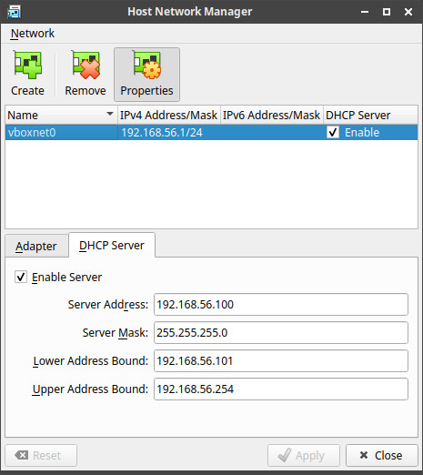
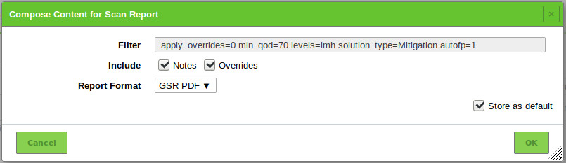

# Table of Contents

1.  [Requirements](#org9a6b7c4)
2.  [Network setup](#orge6300fc)
3.  [Virtual machines setup](#orgc5ff56f)
    1.  [OpenVAS VM setup ](#orge3450ff)
    2.  [Metasploitable2 VM setup ](#orgef2c60b)
    3.  [Exporting to `.ova`](#org0c2a64f)
4.  [Laboratory](#org649a90d)
    1.  [First steps](#org577fb49)
    2.  [What is OpenVAS?](#org6ee8f8d)
    3.  [Network vulnerability feed](#org21b0455)
    4.  [Default scan configurations](#org56af013)
    5.  [Custom scan configurations ](#org15f4c3e)
        1.  [Exercise](#orgecb7cb1)
    6.  [Scan results](#orge909d1b)
        1.  [CVSS ](#org5d3b3f5)
        2.  [Report export](#org7bfad7b)
5.  [References](#org3253ffc)

Notes for the OpenVAS lab for the Network Security class.

# Requirements

We are going to use

-   Oracle VM VirtualBox 6.1.16 (download [here](https://www.virtualbox.org/wiki/Downloads))
-   GSM TRIAL 20.08.8 (download [here](https://www.greenbone.net/en/testnow/#toggle-id-4-closed))
-   Metasploitable 2 (download [here](https://information.rapid7.com/download-metasploitable-2017.html))

# Network setup

Before using the VMs be sure to have them connected through a host-only network: we don&rsquo;t want to expose our VMs to the network, especially the vulnerable target. To setup a `Host-only Adapter`

-   Go to `File > Host Network Manager...`
-   Click on `Create`, take note of the name of the adapter (e.g. `vboxnet0`)
-   Click on `Properties > DHCP Server > Enable Server`
-   Click `Apply` and close the window

To connect a VM select it and go to `Settings > Network`. On the tab `Adapter 1` set `Attached to: Host-only Adapter` and set the right adapter (e.g. `voboxnet0`). Start the virtual machine.

# Virtual machines setup

## OpenVAS VM setup <a id="fnr.1" class="footref" href="#fn.1">1</a>

1.  Open VirtualBox and import the GSM TRIAL image, be sure to [connect it to the network adapter](#orge6300fc).
2.  Start the virtual machine: the Greenbone OS is loaded. Access the Greenbone Administration panel with `admin:admin`.
3.  The first log in starts the `First Setup Wizard`, select `Yes` to continue.
4.  We are asked to create a web user (required to access the web interface), select `Yes` and input account name `admin` and password `admin`. Select `OK`, a message informs the user that the web administrator has been created, and again select `OK` to close the message.
5.  Since we have no valid GSF subscription key, the application only uses the public Greenbone Community Feed (GCF) and not the Greenbone Security Feed (GSF). Skip the the subscription key dialog.
6.  A status check is performed, and the manager is ready to be used.
7.  Logout from the the administration panel. In the welcome screen, take note of the IP address used by the web interface and shut down the VM.
8.  From the host machine, open a browser and connect to the IP address of the machine (e.g. <https://192.168.56.102>). After accepting the self-signed certificate, access the web interface and login with the previously set credentials.

## Metasploitable2 VM setup <a id="fnr.2" class="footref" href="#fn.2">2</a> , <a id="fnr.3" class="footref" href="#fn.3">3</a>

Metasploitable 2 is an intentionally vulnerable Ubuntu Linux virtual machine that is designed for testing common vulnerabilities. The metasploitable ISO is VMWare format.

1.  Unzip the file and create a new VM: choose `Linux->Ubuntu (64bit)`, give it at least at least 1024MB RAM and do not create a HDD. Wait and add the disk `*.vmdk`, remember to [connect the VM to the network adapter](#orge6300fc). Start the virtual machine.
2.  Login using the credentials `msfadmin:msfadmin` and with `ifconfig` retrieve the IP address assigned to the VM
3.  From the host machine, open a browser and connect to the noted IP address (e.g. <https://192.168.56.101>). After accepting the self-signed certificate, access the web interface: a metasploitable2 web page should be displayed.

## Exporting to `.ova`

We can now create an `.ova` file containing two VMs: one for GSM, the other for Metasploitable 2.

1.  In VirtualBox, go to `File > Export Appliance` and select the VMs just created, click `Next`
2.  Select `Format: Open Virtualization Format`, set the path to your `.ova` file in `File:`. Click on `Next`.
3.  Set the names of the two VMs (e.g. `Metasploitable2` and `OpenVAS`) and click on `Export`.

# Laboratory

We have the following environment setup

-   OpenVAS virtual machine
    -   **Greenbone Administration panel:** `admin:admin`
    -   **Greenbone Web panel:** `admin:admin`
-   Metasploitable2 virtual machine
    -   **Metasploitable2 panel:** `msfadmin:msfadmin`
-   The two VMs are connected to a host-only network (see more in the section [Network setup](#orge6300fc))

## First steps

First of all, we need to check what is the actual IP address assigned by the DHCP server, in our case

-   **Metasploitable2 (e.g. `192.168.56.4`):** Login and use `ifconfig` to find out the IP address
-   **OpenVAS (eg `192.168.56.101`):** The IP address is prompted in the console when the machine is started

From now on we are going to interact only through the Greenbone Web panel: connect to it through a web browser and login with the credentials `admin:admin`.

The first thing we can do is scheduling a network scan to find out who is connected to the network. From the top menu, go to `Scans > Tasks` and move the cursor to the magic wand icon, select `Advanced Task Wizard`.

Input the following settings and the click on `Create`

-   **Task name:** `Network discovery`
-   **Scan Config:** `Discovery`
-   **Target Host(s):** The IP address of the host-only subnet created in VirtualBox (e.g. `192.168.56.0/24`)
-   **Start Time:** `Start immediately`

We repeat the same process to create another task, this time with the following settings

-   **Task name:** `Target scan`
-   **Scan Config:** `Full and fast`
-   **Target Host(s):** The IP address of the Metasploitable2 VM (e.g. `192.168.56.4`)
-   **Start Time:** `Start immediately`

The two scans will take few minutes to complete, meanwhile we can have an overview of the tool.

## What is OpenVAS?

OpenVAS (Open Vulnerability Assessment Scanner) is <a id="fnr.4" class="footref" href="#fn.4">4</a>

-   A full-featured scan engine that executes a continuously updated and extended feed of Network Vulnerability Tests (NVTs).
-   Part of GVM (Greenbone Vulnerability Management)

The GVM architecture is described by the scheme below

## Network vulnerability feed

OpenVAS can use two daily updated feeds of Network Vulnerability Tests (NVTs)

-   **GCF:** Greenbone Community Feed, available with the free version
-   **GSF:** Greenbone Security Feed, available with the commercial version. Includes advanced NVTs to target enterprise environments. If no valid GSF subscription key is stored on the appliance, the appliance only uses the public Greenbone Community Feed (GCF) and not the GSF.

At the time of writing, GCF can count on more than 60.000 NVTs. This list can be accessed through the Greenbone web panel in the menu `SecInfo > NVTs`.

## Default scan configurations

Scans allow to execute a series of NVTs for a given target. There are some default scan configurations already available

-   **Base:** Basic configuration template with a minimum set of NVTs required for a scan.
-   **Discovery:** Network discovery scan for open ports, used hardware, firewalls, used services, installed software and certificates.
-   **Host Discovery:** Used port scanner is Ping Host, which detects whether a host is alive.
-   **System Discovery:** This scan configuration is used to detect target systems including installed operating systems and used hardware.
-   **Full and fast:** For many environments this is the best option to start with. This scan configuration is based on the information gathered in the previous port scan and uses almost all VTs (excluding VTs that can damage the target system when used). VTs are optimized in the best possible way to keep the potential false negative rate especially low.

## Custom scan configurations <a id="fnr.5" class="footref" href="#fn.5">5</a> , <a id="fnr.6" class="footref" href="#fn.6">6</a>

While default configurations are good for most of the cases, we might want to look for a more specific target and/or vulnerabilities and reduce the time required for a scan: this can be done by creating a custom scan configuration that works with a specific set of NVTs.

### Exercise

We want to create a scan configuration that focuses on databases vulnerabilities, to do so

1.  Go to `Configuration > Scan Configs` and click on `New Scan Config`
2.  Set the name of the scan to `Web application abuses`. We want start from an empty scan config and then enable few NVTs, so set `Base` to `Empty, static and fast` and save the configuration.
3.  On the column `Actions`, click on edit icon. Among the NVT families, find the one named `Web application abuses` and check the `Select all NVTs` column.

The new scan configuration is ready to be used for a new scan. Setup more custom configurations and run them on the target VM to discover more vulnerabilities (hint: web servers an and SMTP servers might be a good start).

## Scan results

Click on the date of a report to display its details and open the following registers

-   **Information:** General information about the corresponding scan.
-   **Results:** List of all results in this report.
-   **Hosts:** Scanned hosts (host names + IP addresses). The detected operating systems, the number of found vulnerabilies for each severity and the highest severity found by the scan are displayed.
-   **Ports:** Scanned ports with port name, number of hosts and highest severity found by the scan.
-   **Applications:** Scanned applications with CPE (Common Platform Enumeration) of the application, number of hosts, number of occurrences of results that detected this CPE and highest severity found by the scan.
-   **Operating Systems:** Scanned operating systems with system name, host name, number of scanned hosts and highest severity found by the scan.
-   **CVEs:** CVEs (Common Vulnerability Enumerations) found with the scan.
-   **Closed CVEs:** CVEs of originally detected vulnerabilities which were already confirmed as solved during the scan.
-   **TLS Certificates:** TLS certificates found with the scan.
-   **Error Messages:** Error messages that occurred during the scan.
-   **User Tags:** Assigned tags.

From here, the register `Results` contains a list of all vulnerabilities detected by the GSM: for every result the following information is displayed.

-   **Vulnerability:** Name of the found vulnerability, details are shown by clicking on it
-   **Solution type:** Possible solution found for the vulnerability
-   **Severity:** Measured with the CVSS (Common Vulnerability Scoring System), current CVSS score version is 3.1.
-   **QoD:** Quality of Detection, shows the reliability of the detection of a vulnerability.
-   **Host:** The IP address and the name of the host of the target host.
-   **Location:** Port number and protocol type used to find the vulnerability on the host.
-   **Created:** Date and time of the report creation.

### CVSS <a id="fnr.7" class="footref" href="#fn.7">7</a>

The Common Vulnerability Scoring System (CVSS) is a published standard used by organizations worldwide

-   Provides a way to capture the principal characteristics of a vulnerability and produce a numerical score reflecting its severity
-   Numerical score can be used to get a qualitative measure (such as low, medium, high, and critical)
-   Developed by the CVSS Special Interest Group (CVSS-SIG) of the Forum of Incident Response and Security Teams (FIRST)

### Report export

-   Select `Scans > Reports` in the menu bar.
-   Click on the date of a report to open the details page of the report.
-   Click the download icon, select from the opened dialog the desired format.

The PDF file includes, a ordered list of vulnerabilities (from highest to lowest severity): below an example of how a vulnerability is displayed using this format.

## Defintions
`Vulnerabilities` 
`Threat` 
`Risk` 
`Impacts` 

## Risk Assessments
`Definition` 
`Benefits` 
`Methodology` 

## Impacts
`C,I,A` 

## Qualitative Assessments
`Methodology`
`Benefits / Drawbacks`

## Quantitative Assessments
`Benefits/Drawbacks`
`Tools`
- Scoring Systems : CVSS operation
- Scanners
# References

-   [Greenbone Security Manager with Greenbone OS 20.08 - User Manual](https://docs.greenbone.net/GSM-Manual/gos-20.08/en/)
-   [A Brief Introduction to the OpenVAS Vulnerability Scanner](https://resources.infosecinstitute.com/topic/a-brief-introduction-to-the-openvas-vulnerability-scanner/)
-   [OpenVAS/GVM: An Open Source Vulnerability Scanning and Management System](https://securitytrails.com/blog/openvas-vulnerability-scanner)
-   [Exercise on vulnerability scan and accessment](http://knight.segfaults.net/EEE473Labs/Lab%206%20Part%202%20-%20Vulnerability%20Scanning%20with%20OpenVAS.htm)
-   [Lab example with OpenVAS](http://webpages.eng.wayne.edu/~fy8421/16sp-csc5991/labs/lab3-instruction.pdf)

# Footnotes

<a id="fn.1" href="#fnr.1">1</a> <https://resources.infosecinstitute.com/topic/a-brief-introduction-to-the-openvas-vulnerability-scanner/>

<a id="fn.2" href="#fnr.2">2</a> <https://medium.com/hacker-toolbelt/metasploitable-2-i-lab-setup-8cd4472d7958>

<a id="fn.3" href="#fnr.3">3</a> <https://docs.rapid7.com/metasploit/metasploitable-2/>

<a id="fn.4" href="#fnr.4">4</a> <https://community.greenbone.net/t/about-gvm-10-architecture/1231>

<a id="fn.5" href="#fnr.5">5</a> <https://www.hackingtutorials.org/scanning-tutorials/openvas-9-part-4-custom-scan-configurations/>

<a id="fn.6" href="#fnr.6">6</a> <https://community.greenbone.net/t/hint-self-created-scan-configs-copy-of-empty-scan-config-showing-no-results/331>

<a id="fn.7" href="#fnr.7">7</a> <https://docs.greenbone.net/GSM-Manual/gos-5/en/managing-secinfo.html#cvss>
